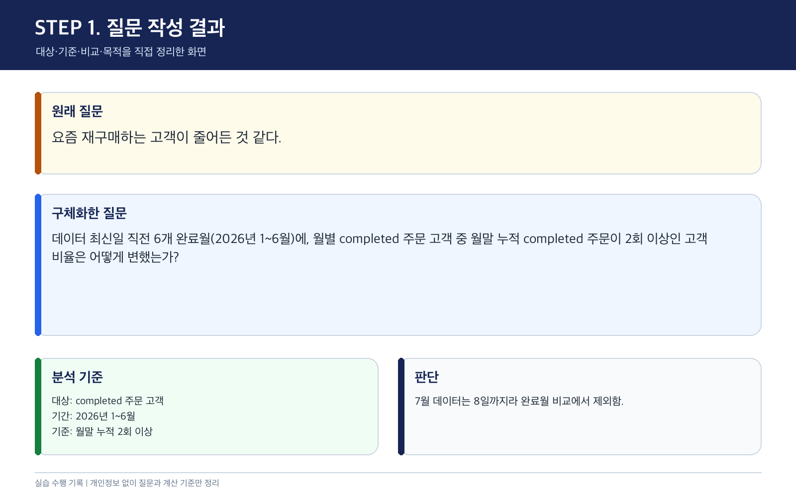
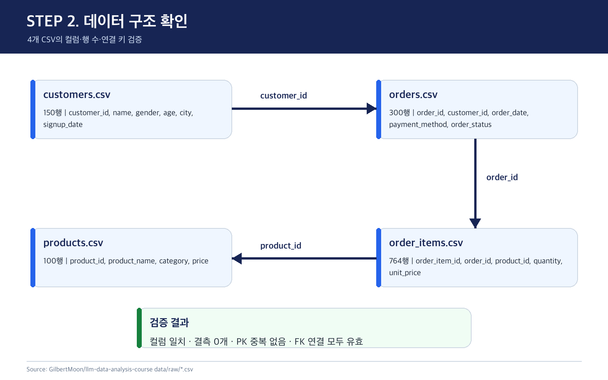
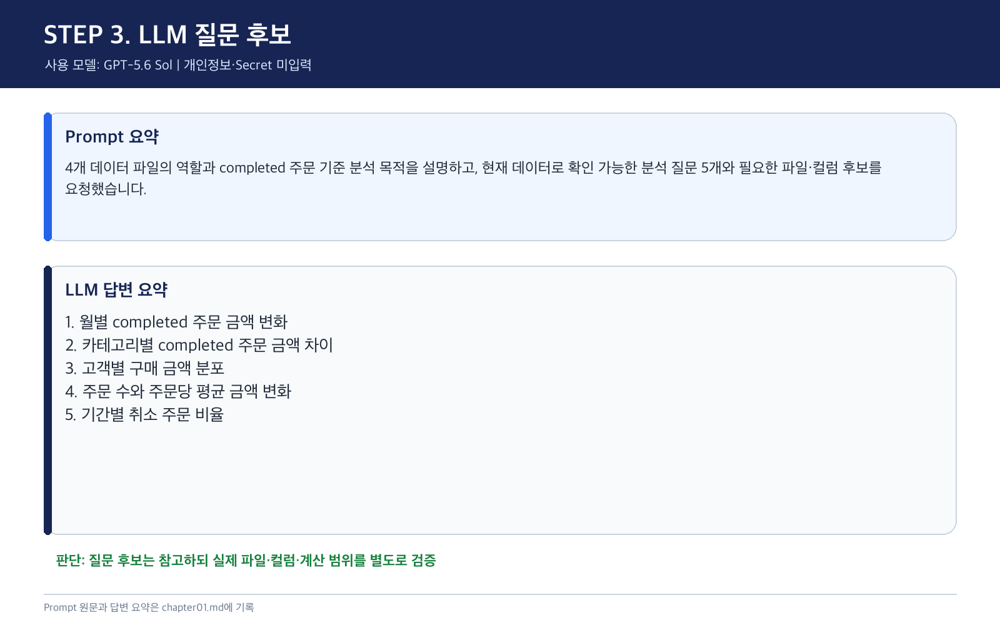
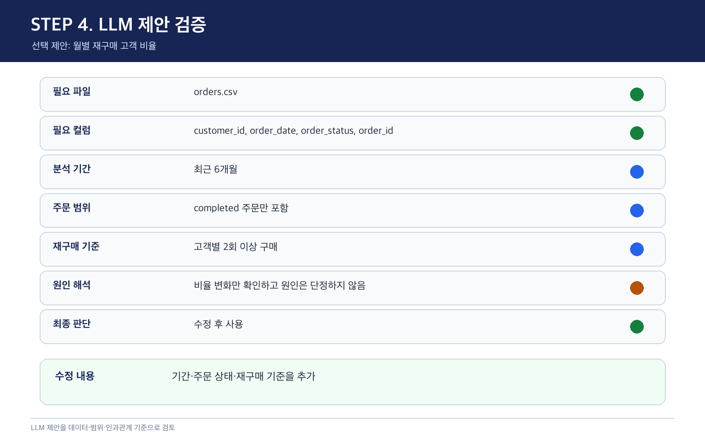
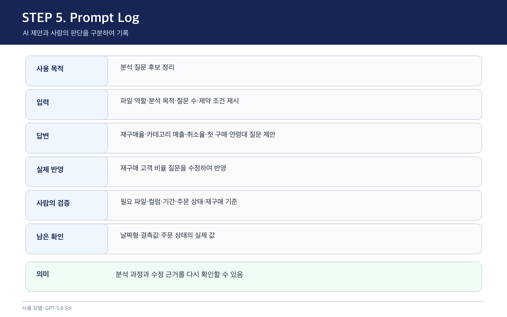
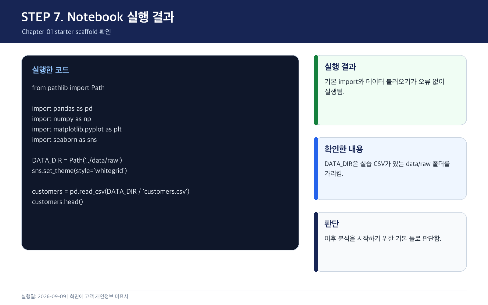

# Chapter 01 실습 기록

## 제출 정보

| 항목 | 내용 |
|---|---|
| 이름 | 김종은 |
| GitHub ID | risa0122 |
| 저장소명 | llm-data-analysis-study |
| 작성일 | 2026-09-09 |
| 사용한 LLM | GPT-5.6 Sol |
| 제출 방식 | GitHub 최종 파일 URL |
| 최종 제출 URL | https://github.com/risa0122/llm-data-analysis-study/blob/main/chapter01/chapter01.md |

### LMS 제출용 URL

```text
https://github.com/risa0122/llm-data-analysis-study/blob/main/chapter01/chapter01.md
```

## STEP 1. 막연한 질문을 분석 가능한 질문으로 바꾸기

### 원래 업무 질문

> 요즘 재구매하는 고객이 줄어든 것 같다.

기준 시점·재구매 정의·대상 범위가 없어 바로 분석하기 어려운 질문임.

### 수행 내용

원래 질문을 대상·기준·비교·목적으로 나눠 정리함.

| 항목 | 구체화한 내용 |
|---|---|
| 대상 | `completed` 주문을 한 고객 |
| 기준 | 해당 월까지 누적 `completed` 주문이 2회 이상인 고객의 비율 |
| 비교 | 데이터 최신일 직전 6개 완료월(2026-01~2026-06)의 월별 변화 |
| 목적 | 재구매 감소 여부를 확인하고 고객 활동 시책의 필요성을 판단 |

### 실행 결과

> 데이터 최신 주문일(2026-07-08) 직전 6개 완료월인 2026년 1~6월에, 월별 `completed` 주문 고객 중 해당 월까지 누적 `completed` 주문이 2회 이상인 고객 비율은 어떻게 변했는가?

### 결과 관찰

원래 질문에는 분석 기간, 주문 상태, 재구매 기준이 빠져 있었음. 데이터의 7월 기록은 8일까지라 완료월 비교에서 제외함.

### 나의 해석과 판단

불완전한 7월을 포함하면 월 중간 수치가 감소처럼 보일 수 있음. 2026년 1~6월과 누적 완료 주문 2회 이상을 기준으로 정한 뒤 분석 가능한 질문이 됐다고 판단함.

### 업무적 의미

월별 재구매 고객 비율이 낮아진 시점을 찾으면 원인 분석과 재구매 방안 검토의 우선순위를 정할 수 있음.

### 한계 및 추가 확인

데이터가 2025-07-09부터 시작하므로 그 이전 구매 이력은 알 수 없음. 따라서 초반 월의 재구매 고객 비율은 실제보다 낮게 계산될 수 있으며, `customer_id`의 일관성과 환불 주문 처리 기준도 확인 필요.

### 실행 증거



## STEP 2. 데이터 구조 파악하기

### 수행 내용

CSV 4개를 직접 읽어 행 수, 컬럼명, 결측, 기본키 중복, 외래키 연결 여부를 확인함.

### 필요한 데이터 파일

- [ ] `customers.csv`
- [ ] `products.csv`
- [x] `orders.csv`
- [ ] `order_items.csv`

현재 질문의 1차 분석에는 `orders.csv`만 필요함. 나머지 파일은 고객·상품 특성을 추가 분석할 때 사용 가능함.

### 실행 결과

| 파일 | 확인한 행 수 | 확인한 컬럼 | 역할 |
|---|---|---|
| `customers.csv` | 150행 | `customer_id`, `name`, `gender`, `age`, `city`, `signup_date` | 고객 기본 정보 |
| `orders.csv` | 300행 | `order_id`, `customer_id`, `order_date`, `payment_method`, `order_status` | 주문 단위 정보 |
| `order_items.csv` | 764행 | `order_item_id`, `order_id`, `product_id`, `quantity`, `unit_price` | 주문별 상품과 금액 정보 |
| `products.csv` | 100행 | `product_id`, `product_name`, `category`, `price` | 상품 기본 정보 |

### 파일 관계

```text
customers.csv
  └─ customer_id → orders.csv
                       └─ order_id → order_items.csv
                                          └─ product_id → products.csv
```

### 현재 질문에 필요한 데이터

이번 질문은 고객별 완료 주문 횟수와 주문 월을 계산하면 되므로 `orders.csv`가 핵심 파일임.

| 필요한 컬럼 | 사용 이유 |
|---|---|
| `order_id` | 주문 건 식별 |
| `customer_id` | 고객별 구매 횟수 계산 |
| `order_date` | 2026년 1~6월과 주문 월 구분 |
| `order_status` | `completed` 주문만 선택 |

### 결과 관찰

질문에 필요한 고객 ID, 주문일, 주문 상태 컬럼이 `orders.csv`에 존재함. 네 파일 모두 결측 행과 기본키 중복이 0건이었고 외래키 연결도 유효했음.

### 나의 해석과 판단

현재 질문은 `orders.csv`만으로 1차 분석 가능하다고 판단함. 고객 특성은 `customers.csv`, 상품·카테고리는 `order_items.csv`와 `products.csv`를 연결해야 함.

### 업무적 의미

먼저 필요한 파일을 좁히면 불필요한 결합을 줄이고 분석 기준을 단순하게 유지할 수 있음.

### 한계 및 추가 확인

파일 구조는 확인했지만 `customer_id`가 탈퇴·재가입 고객까지 같은 사람으로 관리되는지는 데이터만으로 알 수 없음.

### 실행 증거



## STEP 3. LLM에게 분석 질문 후보 받기

### 사용 목적

현재 데이터 구조에서 만들 수 있는 분석 질문 후보를 넓게 확인하기 위해 사용함.

### 사용한 프롬프트

```text
온라인 쇼핑몰 데이터 분석을 준비하고 있다.
데이터는 다음 4개 파일로 구성된다.
- customers.csv: 고객 정보
- products.csv: 상품 정보
- orders.csv: 주문 정보
- order_items.csv: 주문 상세 정보

목적은 completed 주문 기준 구매 패턴을 이해하는 것이다.
초보 데이터 분석자가 먼저 확인할 분석 질문 5개를 제안해 줘.
각 질문마다 필요한 데이터 파일과 확인할 컬럼 후보도 적어 줘.
원인을 단정하지 말고 현재 데이터로 확인 가능한 질문만 제안해 줘.
실제 개인정보 값은 사용하지 않는다.
```

### 실행 결과: LLM 응답 요약

| 번호 | 제안 질문 | 필요한 파일 | 주요 컬럼 후보 |
|---|---|---|---|
| 1 | 월별 재구매 고객 비율은 어떻게 변하는가? | `orders.csv` | `order_id`, `customer_id`, `order_date`, `order_status` |
| 2 | 상품 카테고리별 매출과 주문금액은 어떻게 다른가? | `orders.csv`, `order_items.csv`, `products.csv` | `order_status`, `order_id`, `product_id`, `quantity`, `unit_price`, `category` |
| 3 | 결제수단별 취소율은 어떻게 다른가? | `orders.csv` | `payment_method`, `order_status` |
| 4 | 가입 후 첫 구매까지 걸린 기간은 어느 정도인가? | `customers.csv`, `orders.csv` | `customer_id`, `signup_date`, `order_date` |
| 5 | 연령대별 평균 구매금액은 어떻게 다른가? | `customers.csv`, `orders.csv`, `order_items.csv` | `age`, `customer_id`, `order_id`, `quantity`, `unit_price` |

### 결과 관찰

LLM은 질문 5개를 제안함. 이 중 2개는 `orders.csv` 한 파일로 확인 가능했고, 3개는 2~3개 파일의 연결이 필요했음.

### 나의 해석과 판단

재구매 비율 질문이 처음 정한 업무 문제와 직접 연결되고 한 파일로 확인 가능해 1번을 선택함.

### 업무적 의미

LLM을 사용해 데이터 구조에서 만들 수 있는 질문의 범위를 빠르게 확인함. 다만 최종 질문 선택은 원래 업무 문제와 실행 가능성을 기준으로 직접 판단함.

### 한계 및 추가 확인

LLM이 제안한 질문은 분석 기준이 완전하지 않음. 기간, 주문 상태, 재구매 정의를 사람이 추가해야 함.

### 실행 증거



## STEP 4. LLM 제안 검증하기

### 수행 내용

선택한 재구매 질문을 `orders.csv`의 실제 컬럼, 결측, 상태값, 날짜 범위와 비교함.

### 실행 결과

| 검증 항목 | 확인 내용 |
|---|---|
| 선택한 LLM 제안 | 월별 재구매 고객 비율은 어떻게 변하는가? |
| 필요한 파일 | `orders.csv` |
| 필요한 컬럼 | `order_id`, `customer_id`, `order_date`, `order_status` |
| 실제 파일 확인 | 300행, 필요한 4개 컬럼 결측 0건 |
| 상태값 확인 | `completed` 184건, `cancelled` 64건, `refunded` 52건 |
| 날짜 범위 확인 | 2025-07-09~2026-07-08 |
| 계산 범위 | 불완전한 2026년 7월을 제외한 2026년 1~6월의 `completed` 주문 |
| 재구매 기준 | 해당 월까지 누적 `completed` 주문 2회 이상 |
| 원인 단정 여부 | 비율 변화만 확인하며 감소 원인은 단정하지 않음. |
| 최종 판단 | 수정 후 사용 |

### 내가 수정한 내용

LLM 제안에 2026년 1~6월, `completed` 주문, 월별 누적 구매 2회 이상이라는 조건을 추가함.

### 결과 관찰

필요한 컬럼은 실제 데이터에 존재했고 결측도 없었음. 다만 LLM 응답에는 기간과 재구매 계산 기준이 없었음.

### 나의 해석과 판단

LLM 제안을 정답으로 사용하지 않고 데이터 구조와 업무 목적을 기준으로 검증해야 함을 확인함.

### 업무적 의미

분석 기준을 먼저 고정하면 결과를 반복 계산하거나 다른 사람과 비교할 때 기준 차이를 줄일 수 있음.

### 한계 및 추가 확인

이번 실습에서는 누적 2회 이상으로 정했지만 실제 업무에서도 같은 정의를 사용하는지는 담당자 확인 필요.

### 실행 증거



## STEP 5. 프롬프트 로그 작성하기

### 수행 내용

사용한 Prompt, LLM 답변, 실제 반영 내용, 사람의 수정과 남은 확인 사항을 구분해 기록함.

### 실행 결과

| 항목 | 기록 |
|---|---|
| 목적 | 데이터 구조로 분석 가능한 질문 후보 찾기 |
| 입력 정보 | 파일명과 역할, 분석 목적, 질문 수, 원인 단정 금지·개인정보 미사용 조건 |
| LLM 응답 | 재구매율, 카테고리 매출, 결제수단별 취소율 등 질문 5개 |
| 실제 반영 | 재구매 고객 비율 질문을 선택 |
| 사람이 검증한 내용 | 필요한 컬럼 존재 여부, 업무 목적과의 연결, 계산 기준의 명확성 |
| 사람이 수정한 내용 | 2026년 1~6월, `completed`, 월별 누적 구매 2회 이상 조건 추가 |
| 남은 확인 사항 | 실제 업무의 재구매 정의와 환불 주문 처리 기준 |

### 결과 관찰

LLM은 질문 방향을 제안했고, 사람은 실제 데이터의 최신일과 상태값을 확인해 기간과 계산 기준을 수정했음.

### 나의 해석과 판단

프롬프트 로그는 단순 대화 기록이 아니라 분석 기준이 만들어진 과정을 남기는 자료라고 판단함.

### 업무적 의미

같은 분석을 다시 수행하거나 다른 사람이 검토할 때 질문이 바뀐 이유를 확인할 수 있음.

### 한계 및 추가 확인

실제 수치 분석 단계에서는 코드, 실행 결과, 수정 이력도 함께 기록해야 함.

### 실행 증거



## STEP 6. 보안 체크리스트 확인하기

| 점검 항목 | 확인 결과 |
|---|---|
| 실제 이름·이메일·전화번호 등 고객 개인정보를 Prompt에 사용하지 않았는가 | 예 |
| API Key를 코드나 Notebook에 직접 작성하지 않았는가 | 예 |
| `.env` 실제 내용을 캡처하거나 업로드하지 않았는가 | 예 |
| GitHub Token·비밀번호·내부 URL이 캡처에 보이지 않는가 | 예 |
| 제출 전 이미지까지 다시 확인했는가 | 예 |

### 나의 해석과 판단

분석 질문을 만드는 단계에서는 실제 고객값이 필요하지 않음. 파일 역할과 컬럼 구조만으로 충분하므로 최소 정보만 사용함.

### 한계 및 추가 확인

이후 결과를 공유할 때도 소수 고객을 특정할 수 있는 값이나 원본 행이 노출되지 않는지 다시 확인해야 함.

## STEP 7. 노트북 시작 환경 실행하기

수업에서 제공한 시작 코드를 기준으로 기본 라이브러리와 CSV 경로를 확인함.

```python
from pathlib import Path
import pandas as pd
import numpy as np
import matplotlib.pyplot as plt
import seaborn as sns

DATA_DIR = Path("../data/raw")
sns.set_theme(style="whitegrid")

customers = pd.read_csv(DATA_DIR / "customers.csv")
customers.shape
customers.columns.tolist()
```

### 실행 결과

- `Path`와 `pandas` import가 정상 실행됨.
- `DATA_DIR`가 CSV 폴더를 가리키는지 확인함.
- `customers.csv`를 불러온 결과 `(150, 6)`을 확인함.
- 컬럼은 `customer_id`, `name`, `gender`, `age`, `city`, `signup_date`로 확인됨.
- 개인정보가 포함된 원본 행은 Evidence에 표시하지 않음.

### 결과 관찰

기본 import와 데이터 불러오기 단계에서 오류가 없었고 150행·6열이 확인됨.

### 나의 해석과 판단

다음 장에서 분석 코드를 작성하기 위한 시작 환경이 준비됐다고 판단함.

### 한계 및 추가 확인

이번 장에서는 분석 환경 확인까지만 수행함. 재구매율 계산과 시각화는 이후 단계에서 진행 필요.

### 실행 증거



## STEP 8. 최종 해석

### 이번 장에서 가장 중요하다고 생각한 내용

원래 질문은 재구매 감소의 기준이 없어 바로 분석할 수 없었음. 데이터 구조를 확인한 뒤 2026년 1~6월, `completed` 주문, 월별 누적 구매 2회 이상이라는 조건을 추가함. LLM은 질문 후보를 넓히는 데 도움이 됐지만 기간과 계산 기준은 실제 데이터를 보고 직접 수정해야 했음. 이번 장에서는 질문 정의와 검증까지 완료했으며 재구매율 계산은 다음 분석 단계로 남음.

### LLM을 데이터 분석에 사용할 때 가장 조심해야 할 점

주의할 점은 LLM이 자연스러운 문장으로 답해도 실제 컬럼과 날짜 범위를 확인한 결과는 아니라는 것임. 제안을 사용하기 전에 직접 확인한 사실과 LLM의 제안을 구분해야 함.

### 사람과 LLM의 역할 차이

| 항목 | LLM이 도울 수 있는 부분 | 사람이 책임져야 하는 부분 |
|---|---|---|
| 질문 정의 | 질문 후보 제안 | 업무 목적에 맞는 질문 선택과 기준 확정 |
| 데이터 확인 | 필요한 파일·컬럼 후보 제안 | 실제 존재 여부, 타입, 결측 확인 |
| 코드 작성 | 코드 초안 제안 | 실행 결과와 계산 방식 검증 |
| 결과 해석 | 관찰 가능한 패턴 정리 | 원인 단정 방지와 업무 맥락 반영 |
| 최종 판단 | 선택지와 주의점 제안 | 분석 사용 여부와 의사결정 책임 |

### 다음 Chapter에서 확인하고 싶은 것

정리한 기준으로 실제 월별 재구매 고객 비율을 계산하고 그래프로 확인하고 싶음.

## STEP 9. 제출 전 체크리스트

- [x] 실습을 직접 수행함.
- [x] 요구된 `chapter01.md` 파일을 작성함.
- [x] 막연한 질문을 분석 가능한 질문으로 바꿈.
- [x] 질문에 필요한 데이터 파일과 컬럼 후보를 정리함.
- [x] LLM Prompt와 답변 요약을 작성함.
- [x] LLM 제안을 실제 데이터 관점에서 검증함.
- [x] 무엇을 수행했고 어떤 결과가 나왔는지 작성함.
- [x] 각 핵심 STEP의 결과 관찰을 작성함.
- [x] 각 핵심 STEP의 나의 해석과 판단을 작성함.
- [x] 업무·분석적 의미를 작성함.
- [x] 한계와 추가 확인 사항을 작성함.
- [x] 핵심 실행 Evidence 이미지를 첨부함.
- [x] 이미지가 Markdown에서 정상 표시됨.
- [x] 개인정보가 없음.
- [x] API Key·Secret·Token이 없음.
- [x] 오류가 발생한 Cell을 제출물에 남기지 않음.
- [x] 개인 GitHub 저장소에 업로드함.
- [x] GitHub에서 Markdown과 이미지가 정상 표시됨.
- [x] 최종 파일 URL이 정상적으로 열림.
- [ ] LMS에 최종 파일 URL을 제출함.

## STEP 10. 교수자 확인용 요약

### 수행 상태

- [x] COMPLETE
- [ ] PARTIAL

### 내가 가장 중요하게 내린 판단 1개

LLM 제안은 그대로 사용하지 않고 실제 데이터의 날짜 범위와 상태값을 확인한 뒤 기간·주문 상태·재구매 기준을 추가해 사용함.

### 아직 확인이 필요한 내용 1개

실제 업무에서도 누적 완료 주문 2회 이상을 재구매로 정의하는지 확인해야 함.
