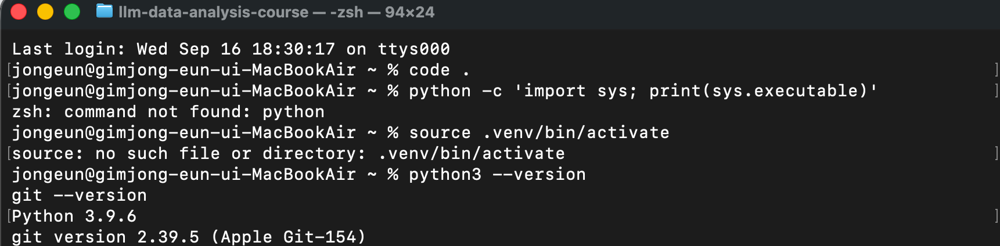
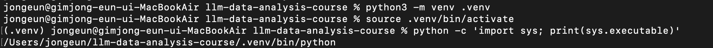
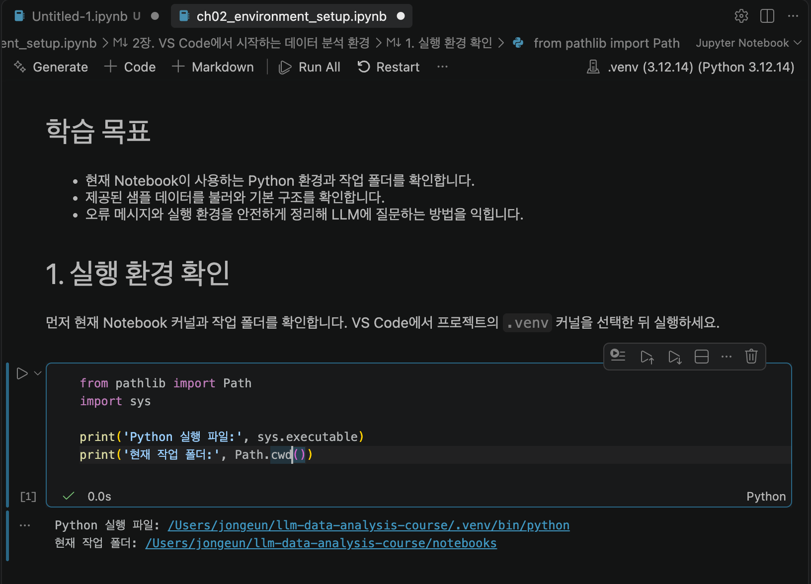
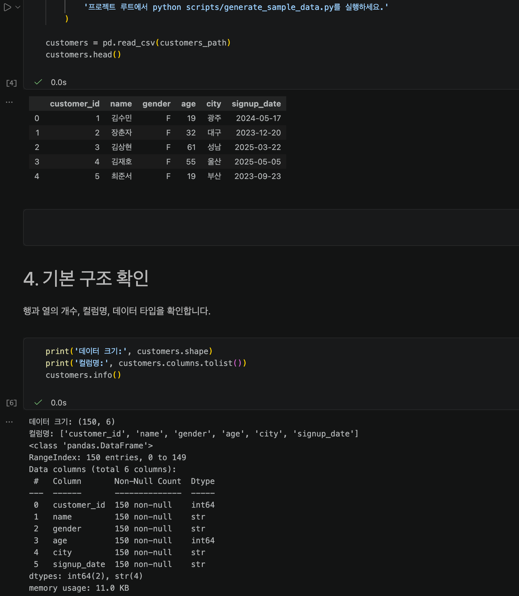
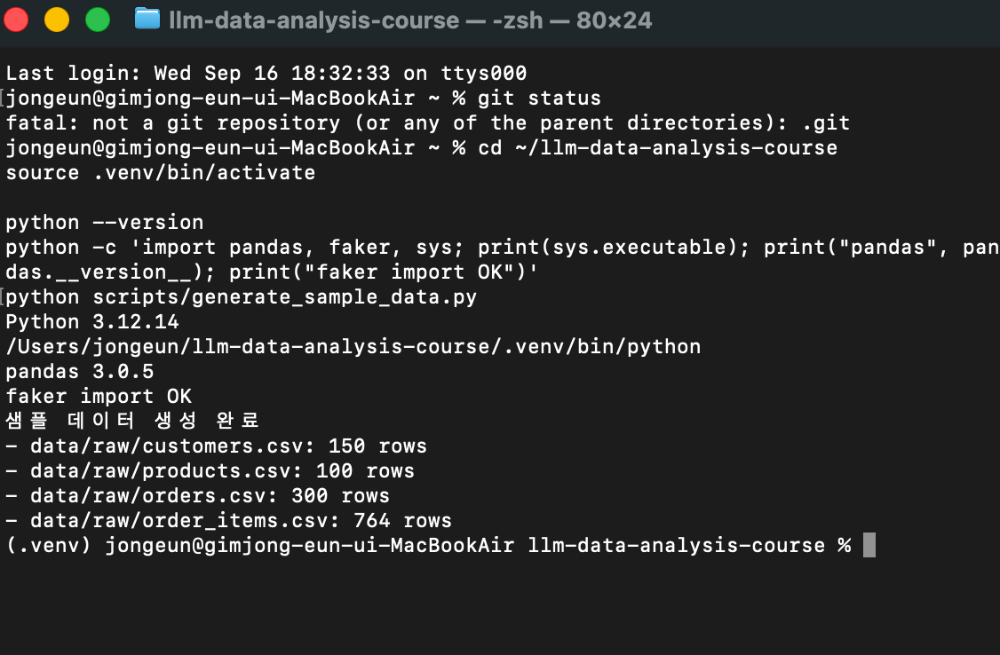
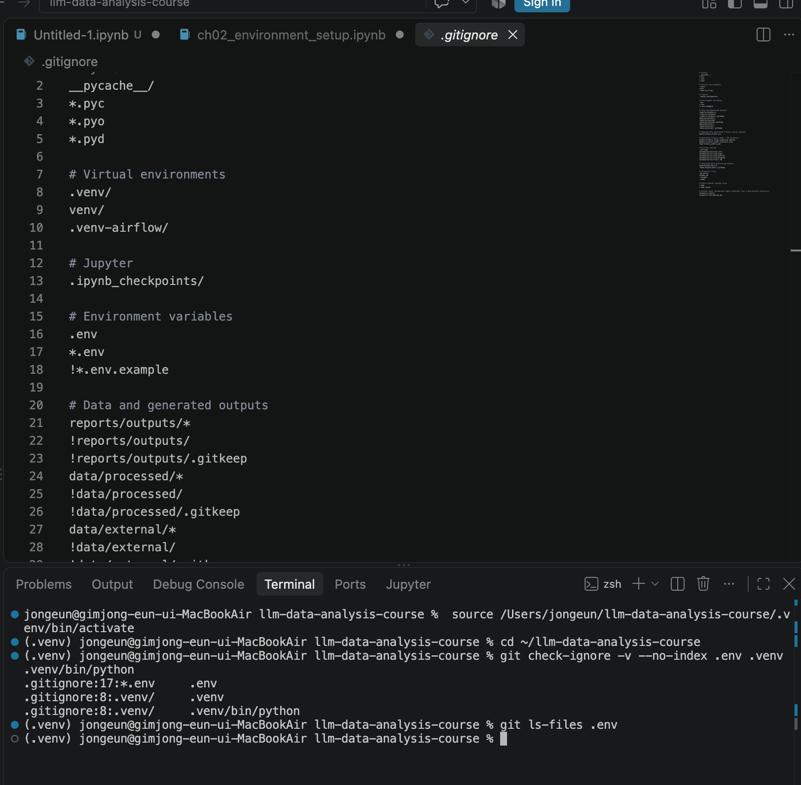

# Chapter 02 실습 기록 — 데이터 분석 환경 구축 및 실행 검증

## 0. 제출 정보

| 항목 | 내용 |
|---|---|
| 이름 | 김종은 |
| GitHub ID | risa0122 |
| 개인 저장소 | llm-data-analysis-study |
| 작성일 | 2026-09-16 |
| 운영체제 | macOS |

### 최종 제출 URL

~~~text
https://github.com/risa0122/llm-data-analysis-study/blob/main/chapter02/chapter02.md
~~~

---

## 1. Python과 Git 환경 확인

### 실행 내용

~~~zsh
python3 --version
git --version
~~~

### 실행 결과

macOS 기본 Python은 Python 3.9.6, Git은 git version 2.39.5로 확인했다. 패키지 설치 과정에서 Python 3.9는 pandas 3.0.5의 Python 3.11 이상 조건과 맞지 않는 것을 확인했다. 그래서 프로젝트 가상환경에는 Python 3.12.14를 사용했다.

### Evidence

### 결과 관찰

처음에는 홈 폴더에서 python과 .venv를 실행해 명령과 경로 오류가 발생했다. 프로젝트 폴더로 이동한 뒤에는 python3과 git 명령이 정상 실행됐고, 기본 Python 버전은 3.9.6이었다.

### 나의 해석과 판단

macOS 기본 Python과 강의 프로젝트에 필요한 Python 버전이 다를 수 있다고 판단했다. 그래서 시스템 Python을 그대로 사용하지 않고 Python 3.12 기반 가상환경을 별도로 준비했다.

### 업무·분석적 의미

프로젝트를 시작할 때 Python과 Git의 버전, 현재 작업 폴더를 먼저 확인하면 설치 오류와 경로 오류를 초기에 구분할 수 있다.

### 한계와 추가 확인 사항

터미널에서 python3은 계속 시스템 Python 3.9를 가리킨다. 이후 프로젝트 작업에서는 가상환경을 활성화한 뒤 python 명령을 사용해야 한다.

---

## 2. 저장소와 .venv 준비

### 수행 내용

- [x] 공식 Public 저장소를 준비했다.
- [x] 프로젝트 루트를 확인했다.
- [x] .venv를 생성하고 활성화했다.
- [x] 실제 Python 실행 경로를 확인했다.
- [x] requirements.txt 패키지를 설치했다.

### 핵심 실행 결과

~~~text
현재 프로젝트 경로: /Users/jongeun/llm-data-analysis-course
터미널 Python 실행 파일: /Users/jongeun/llm-data-analysis-course/.venv/bin/python
가상환경 Python 버전: Python 3.12.14
패키지 설치 결과: pandas 3.0.5, faker import OK
~~~

### Evidence

### 결과 관찰

source .venv/bin/activate 실행 후 터미널 앞에 (.venv)가 표시됐고, sys.executable에도 현재 프로젝트의 .venv/bin/python 경로가 출력됐다.

### 나의 해석과 판단

터미널 표시만 보고 가상환경이 연결됐다고 판단하면 안 되고, 실제 Python 실행 파일 경로까지 확인해야 한다고 판단했다. Python 3.9로 처음 만든 가상환경은 패키지 요구 버전과 맞지 않아 Python 3.12로 다시 만들었다.

### 업무·분석적 의미

프로젝트별 가상환경을 사용하면 같은 PC에 설치된 다른 프로젝트의 패키지와 충돌하지 않고, 필요한 라이브러리 버전을 재현하기 쉬워진다.

### 한계와 추가 확인 사항

새 터미널을 열면 가상환경이 자동으로 활성화되지 않는다. 작업을 시작할 때마다 프로젝트 폴더에서 source .venv/bin/activate를 실행해야 한다.

---

## 3. VS Code 인터프리터와 Jupyter 커널 연결

### 확인 결과

~~~text
VS Code Python 인터프리터: .venv (Python 3.12.14)
Notebook sys.executable: /Users/jongeun/llm-data-analysis-course/.venv/bin/python
Notebook Path.cwd(): /Users/jongeun/llm-data-analysis-course/notebooks
~~~

### Evidence

### 결과 관찰

Notebook 오른쪽 위에서 .venv (Python 3.12.14) 커널을 선택했고, 실행 결과의 sys.executable도 프로젝트 .venv/bin/python을 가리켰다. 작업 폴더는 notebooks로 확인됐다.

### 나의 해석과 판단

터미널에서 패키지를 설치한 Python과 Notebook 커널이 같은 가상환경을 사용하므로 현재 실행 환경이 정상 연결됐다고 판단했다.

### 업무·분석적 의미

터미널과 Notebook이 서로 다른 Python을 사용하면 패키지를 설치했는데도 ModuleNotFoundError가 발생할 수 있다. 실습 시작 단계에서 두 경로를 비교하는 것이 환경 오류를 줄이는 방법이라고 생각한다.

### 한계와 추가 확인 사항

커널 이름만 .venv로 표시된다고 해서 같은 환경이라고 단정할 수 없다. sys.executable 경로로 실제 실행 파일을 확인해야 한다.

---

## 4. 샘플 데이터와 Notebook 실행 검증

### 확인 결과

~~~text
샘플 데이터 생성: customers.csv 150행, products.csv 100행,
orders.csv 300행, order_items.csv 764행
customers.shape: (150, 6)
주요 컬럼: customer_id, name, gender, age, city, signup_date
~~~

### Evidence

### 결과 관찰

Notebook에서 customers.head()가 표 형태로 출력됐고, 데이터 크기는 150행 6열이었다. customers.info() 결과에서 6개 컬럼은 모두 150개의 non-null 값을 가지고 있었으며, customer_id와 age는 정수형, 나머지는 문자열형으로 확인됐다.

### 나의 해석과 판단

Notebook, pandas 패키지, 데이터 경로, customers.csv 파일이 모두 정상 연결됐다고 판단했다. 화면에 표시된 고객 정보는 실습용으로 생성된 샘플 데이터이며, 실제 고객 데이터는 사용하지 않았다.

### 업무·분석적 의미

분석을 시작하기 전에 데이터가 열리는지와 기본 구조가 예상과 같은지 확인하면 이후 분석 단계에서 발생하는 경로·파일·컬럼 오류를 줄일 수 있다.

### 한계와 추가 확인 사항

이번 단계에서는 파일 연결과 기본 구조만 확인했다. 데이터의 결측치, 중복, 키 관계 등 데이터 품질 검증은 다음 분석 단계에서 추가로 확인해야 한다.

---

## 5. 오류 해결 기록

### 오류 메시지

~~~text
fatal: not a git repository (or any of the parent directories): .git
python: command not found
source: no such file or directory: .venv/bin/activate
ERROR: Could not find a version that satisfies the requirement pandas==3.0.5
~~~

### 원인 후보

1. 홈 폴더에서 명령을 실행해 프로젝트의 .venv 경로를 찾지 못했다.
2. 가상환경을 활성화하기 전이라 python 명령을 사용할 수 없었다.
3. macOS 기본 Python 3.9.6이 pandas 3.0.5의 Python 3.11 이상 조건과 맞지 않았다.

### 내가 확인한 순서

1. 현재 위치가 llm-data-analysis-course 프로젝트 루트인지 확인했다.
2. .venv 활성화 후 sys.executable 경로를 확인했다.
3. requirements.txt의 패키지 조건과 Python 버전을 비교했다.
4. Python 3.12로 가상환경을 다시 만들고 패키지를 재설치했다.
5. pandas, faker import와 샘플 데이터 생성을 다시 확인했다.

### 해결 방법

~~~zsh
/opt/homebrew/bin/python3.12 -m venv .venv
source .venv/bin/activate
python -m pip install -r requirements.txt
python scripts/generate_sample_data.py
~~~

### 해결 결과

~~~text
Python 3.12.14
pandas 3.0.5
faker import OK
샘플 데이터 생성 완료
~~~

### Evidence

### 나의 해석과 판단

처음에는 패키지 자체의 문제라고 생각했지만, 오류 메시지의 Requires-Python >=3.11 조건을 확인한 뒤 Python 버전 차이가 원인이라고 판단했다. 오류가 발생했을 때는 마지막 줄만 보지 않고 요구 버전, 현재 경로, 가상환경 상태를 순서대로 확인하는 것이 필요했다.

### 한계와 추가 확인 사항

프로젝트 루트가 아닌 위치에서 실행하면 같은 경로 오류가 다시 발생할 수 있다. 또한 패키지 설치 오류를 해결하기 위해 .venv 외의 파일이나 시스템 설정을 임의로 삭제하지 않았다.

---

## 6. Secret 보호 확인

- [x] .gitignore에서 *.env, .venv/, __pycache__/, .ipynb_checkpoints/ 항목을 확인했다.
- [x] 실제 API Key를 코드에 작성하지 않았다.
- [x] Evidence에 Token, 비밀번호, 실제 .env 내용을 포함하지 않았다.
- [x] git check-ignore -v --no-index .env .venv .venv/bin/python 명령으로 .env와 .venv가 Git 제외 대상임을 확인했다.

### Evidence

### 나의 해석과 판단

가상환경 폴더와 환경변수 파일은 개인 PC에서만 사용하고 GitHub에는 올리지 않아야 한다. 특히 실제 API Key는 코드나 Notebook에 직접 작성하지 않고 .env로 분리해야 한다고 판단했다.

### 한계와 추가 확인 사항

현재 git status에는 샘플 데이터 변경과 개인 작업 파일이 보일 수 있으므로, 제출 저장소에 올릴 때는 git add .을 사용하지 않고 필요한 과제 파일과 Evidence 이미지만 선택해 업로드해야 한다.

---

## 7. Chapter 02 최종 회고

### 가장 중요했다고 생각한 환경 설정 1가지

터미널 Python과 VS Code Notebook 커널이 같은 .venv를 사용하는지 sys.executable 경로로 확인한 과정이 가장 중요했다.

### 그 이유

처음에는 가상환경을 만들기만 하면 된다고 생각했지만, macOS 기본 Python 3.9와 강의 패키지의 Python 요구 버전이 달라 설치 오류가 발생했다. Python 3.12 기반 .venv를 만들고 터미널과 Notebook에서 같은 실행 파일을 확인한 뒤에야 환경이 정상 연결됐다고 판단할 수 있었다.

### 다음 Chapter에서 재사용할 환경 체크 3가지

1. 작업 전 프로젝트 루트에서 .venv를 활성화했는지 확인한다.
2. VS Code 인터프리터와 Notebook 커널의 sys.executable이 같은 .venv인지 확인한다.
3. 데이터 경로가 존재하고 CSV가 정상적으로 열리는지 먼저 확인한다.

### 현재 환경의 한계 또는 주의점

macOS 기본 python3은 Python 3.9.6으로 남아 있으므로, 이 프로젝트에서는 가상환경을 활성화한 뒤 python을 사용해야 한다. 실제 Secret 값과 개인 작업 파일을 GitHub에 올리지 않도록 커밋 전 파일 목록을 다시 확인해야 한다.

---

## 최종 제출 체크

- [ ] STEP 6 Evidence 이미지를 추가함
- [x] 실행 결과와 관찰·판단을 작성함
- [x] Secret/개인정보가 포함되지 않도록 확인함
- [ ] GitHub에서 모든 Evidence 이미지가 정상 표시됨
- [x] 개인 저장소에 chapter02/chapter02.md를 업로드함
- [ ] 저장소 URL이 아니라 최종 파일 URL을 LMS에 제출함
